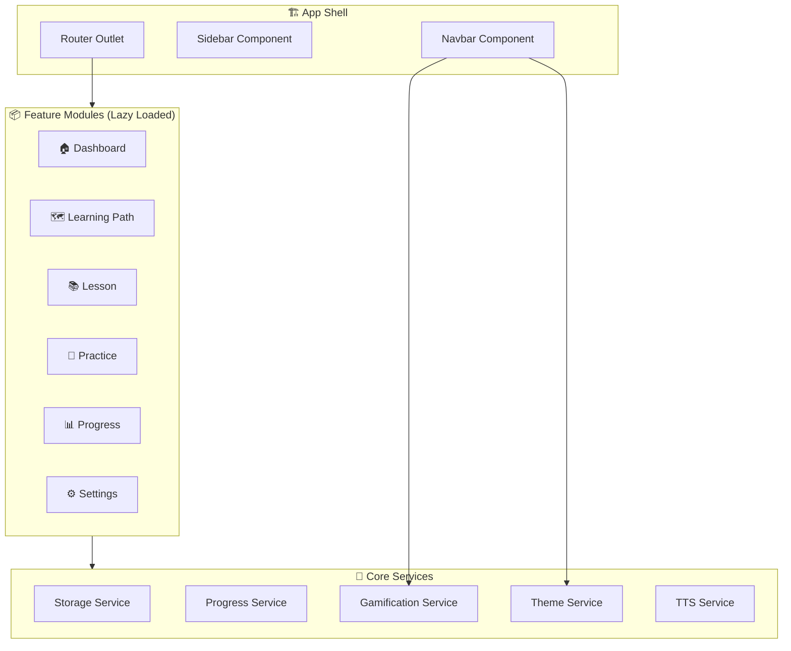
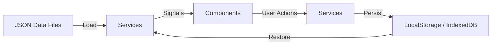

# 🎓 Learn English - Trang Web Tự Học Tiếng Anh Cho Người Mất Gốc

## Tổng Quan

Xây dựng một **Single Page Application (SPA)** giúp người Việt Nam mất gốc tiếng Anh có thể tự học từ con số 0. Ứng dụng tập trung vào trải nghiệm học tập thú vị, trực quan, có lộ trình rõ ràng, và gamification để giữ động lực học.

**Tech Stack:**
- **Frontend Framework:** Angular 19+ (Standalone Components)
- **UI Library:** PrimeNG 19+
- **CSS Framework:** TailwindCSS 4+
- **State Management:** Angular Signals
- **Storage:** LocalStorage / IndexedDB (offline-first, không cần backend)
- **Routing:** Angular Router với lazy loading

---

## User Review Required

> [!IMPORTANT]
> **Không có Backend:** Ứng dụng này hoạt động hoàn toàn ở phía client (frontend-only). Dữ liệu bài học được hardcode/JSON tĩnh, tiến trình học được lưu trong LocalStorage/IndexedDB. Nếu bạn muốn có backend (API, database, authentication), hãy cho tôi biết.

> [!IMPORTANT]
> **Ngôn ngữ giao diện:** Giao diện chính sẽ sử dụng **tiếng Việt** để phù hợp với người mất gốc. Nội dung bài học sẽ song ngữ Việt-Anh. Bạn có đồng ý không?

> [!IMPORTANT]
> **TailwindCSS Version:** Bạn muốn sử dụng TailwindCSS v4 (mới nhất, CSS-first config) hay v3 (ổn định, JS config)? Tôi đề xuất **v4** vì project mới.

---

## Open Questions

> [!WARNING]
> 1. **Phát âm (Text-to-Speech):** Bạn có muốn tích hợp Web Speech API để người dùng nghe phát âm từ vựng/câu mẫu không?
> 2. **Số lượng bài học ban đầu:** Bạn muốn tôi tạo bao nhiêu bài học mẫu cho mỗi cấp độ? (Đề xuất: 5-10 bài/cấp độ cho bản demo)
> 3. **Dark Mode:** Có cần hỗ trợ dark/light mode toggle không? (Đề xuất: Có)
> 4. **Responsive:** Có cần tối ưu cho mobile không? (Đề xuất: Có, mobile-first)
> 5. **PWA:** Có muốn hỗ trợ Progressive Web App để cài đặt trên điện thoại và học offline không?

---

## Phân Tích Đối Tượng Người Dùng

| Đặc điểm | Mô tả |
|-----------|--------|
| **Đối tượng** | Người Việt Nam mất gốc tiếng Anh (học sinh, sinh viên, người đi làm) |
| **Trình độ** | Từ A0 (hoàn toàn mất gốc) đến B1 (sơ-trung cấp) |
| **Nhu cầu** | Lộ trình rõ ràng, bài học ngắn gọn, không áp lực, có phản hồi tức thì |
| **Pain points** | Sợ tiếng Anh, không biết bắt đầu từ đâu, dễ nản, thiếu động lực |
| **Thiết bị** | Chủ yếu điện thoại và laptop |

---

## Cấu Trúc Tính Năng

### 1. 🏠 Trang Chủ (Dashboard)

- **Hero Section** với animation chào mừng, slogan động lực
- **Thống kê nhanh:** Streak ngày học liên tiếp, tổng từ đã học, cấp độ hiện tại
- **Tiến trình học tập** hiển thị bằng progress bar/chart (PrimeNG Chart)
- **Bài học đề xuất** dựa trên tiến trình hiện tại
- **Từ vựng của ngày** (Word of the Day) với phát âm + ví dụ

### 2. 🗺️ Lộ Trình Học (Learning Path)

Chia thành **4 cấp độ** với giao diện roadmap trực quan (giống Duolingo):

#### Cấp 1: Nền Tảng (Foundation) - A0
- Bảng chữ cái & phát âm cơ bản (IPA đơn giản)
- Chào hỏi cơ bản (Hello, How are you, Thank you...)
- Số đếm 1-100
- Ngày tháng, thời gian
- Màu sắc, hình dạng
- Đại từ nhân xưng (I, You, He, She...)

#### Cấp 2: Xây Dựng (Building) - A1
- Cấu trúc câu cơ bản (S + V + O)
- Thì hiện tại đơn (Present Simple)
- Từ vựng: Gia đình, nghề nghiệp, đồ vật hàng ngày
- Câu hỏi Yes/No và câu hỏi WH
- Giới từ cơ bản (in, on, at)

#### Cấp 3: Phát Triển (Developing) - A2
- Thì hiện tại tiếp diễn, quá khứ đơn
- Từ vựng: Thức ăn, du lịch, mua sắm, sức khỏe
- So sánh hơn, so sánh nhất
- Modal verbs (can, should, must)
- Đọc hiểu đoạn văn ngắn

#### Cấp 4: Nâng Cao (Advancing) - B1
- Thì hiện tại hoàn thành, quá khứ tiếp diễn
- Câu điều kiện loại 1, 2
- Từ vựng: Công việc, công nghệ, môi trường
- Viết đoạn văn ngắn
- Nghe hiểu hội thoại

### 3. 📚 Bài Học (Lesson Page)

Mỗi bài học bao gồm các phần:

```
┌─────────────────────────────────────────┐
│  📖 Lý Thuyết (Theory)                 │
│  - Giải thích ngữ pháp bằng tiếng Việt │
│  - Ví dụ song ngữ                      │
│  - Hình ảnh minh họa                    │
├─────────────────────────────────────────┤
│  🎯 Từ Vựng (Vocabulary)               │
│  - Flashcard với hình ảnh              │
│  - Phát âm (audio/TTS)                 │
│  - Ví dụ trong câu                     │
├─────────────────────────────────────────┤
│  ✏️ Bài Tập (Practice)                  │
│  - Trắc nghiệm (Multiple Choice)      │
│  - Điền từ (Fill in the blank)         │
│  - Nối từ (Matching)                   │
│  - Sắp xếp câu (Sentence Ordering)    │
├─────────────────────────────────────────┤
│  🏆 Kết Quả & Phần Thưởng             │
│  - Điểm số + sao (1-3 sao)            │
│  - XP nhận được                         │
│  - Nút làm lại / Tiếp tục             │
└─────────────────────────────────────────┘
```

### 4. 📝 Luyện Tập (Practice Center)

- **Flashcard Mode:** Lật thẻ học từ vựng với Spaced Repetition
- **Quiz Mode:** Bài kiểm tra tổng hợp theo cấp độ
- **Listening Practice:** Nghe và chọn đáp án đúng
- **Sentence Builder:** Kéo thả từ để xếp thành câu hoàn chỉnh

### 5. 📐 Ngữ Pháp Chi Tiết (Grammar)

Tab riêng biệt dành riêng cho việc học ngữ pháp tiếng Anh một cách hệ thống, tổ chức theo **chủ đề ngữ pháp** với giải thích chi tiết bằng tiếng Việt, công thức rõ ràng, ví dụ song ngữ, và bài tập tương tác.

#### Phân loại 4 Category

| Category | Emoji | Nội dung |
|----------|-------|----------|
| **Các Thì (Tenses)** | 🕐 | Present Simple, Present Continuous, Past Simple, Past Continuous, Present Perfect, Future Simple |
| **Cấu Trúc Câu (Sentence Structure)** | 🏗️ | Yes/No & WH Questions, Comparatives & Superlatives, Conditionals (0,1,2), Passive Voice |
| **Từ Loại (Parts of Speech)** | 🧩 | Articles (a/an/the), Adjectives & Adverbs, Prepositions (in/on/at), Modal Verbs |
| **Ngữ Pháp Đặc Biệt (Special Grammar)** | 📎 | There is/are, Possessives, Gerund vs Infinitive |

#### Cấu trúc mỗi chủ đề ngữ pháp

```
┌─────────────────────────────────────────────────┐
│  📌 Tiêu đề + Badge độ khó (Dễ/TB/Khó)         │
├─────────────────────────────────────────────────┤
│  📖 KHI NÀO DÙNG?                               │
│  Giải thích bằng tiếng Việt + tình huống thực   │
├─────────────────────────────────────────────────┤
│  📝 CÔNG THỨC (Formula)                         │
│  ✅ Khẳng định: S + V(s/es) + O                 │
│  ❌ Phủ định:   S + do/does + not + V           │
│  ❓ Nghi vấn:   Do/Does + S + V + O?            │
├─────────────────────────────────────────────────┤
│  🔍 DẤU HIỆU NHẬN BIẾT                         │
│  always, usually, every day, on Mondays...      │
├─────────────────────────────────────────────────┤
│  💡 VÍ DỤ MINH HỌA (có TTS 🔊)                 │
│  Color-coded: xanh lá ✅, đỏ ❌, xanh ❓         │
│  Mỗi câu kèm dịch tiếng Việt                   │
├─────────────────────────────────────────────────┤
│  ⚠️ LỖI SAI THƯỜNG GẶP                         │
│  So sánh wrong vs correct cho người Việt        │
├─────────────────────────────────────────────────┤
│  📊 BẢNG SO SÁNH (nếu có)                       │
│  So sánh với thì/cấu trúc tương tự             │
├─────────────────────────────────────────────────┤
│  ✏️ BÀI TẬP NHANH (3-5 câu MCQ + Fill-blank)   │
│  Phản hồi đúng/sai + giải thích                │
└─────────────────────────────────────────────────┘
```

#### Tính năng bổ sung
- **Thanh tìm kiếm** filter topics theo tên
- **Đánh dấu đã đọc** cho mỗi topic (lưu vào LocalStorage)
- **Điều hướng** trước/sau giữa các topics
- **Progress tracker** hiển thị số topic đã đọc

### 6. 📊 Tiến Trình (Progress Tracker)

- **Biểu đồ tiến trình** theo tuần/tháng (PrimeNG Chart)
- **Lịch sử học tập** - calendar view đánh dấu ngày đã học
- **Thành tích (Achievements)** - Huy hiệu đạt được
- **Thống kê chi tiết:** Tổng từ đã học, thời gian học, tỷ lệ đúng

### 7. 🎮 Gamification System

| Tính năng | Mô tả |
|-----------|--------|
| **XP (Experience Points)** | Nhận XP khi hoàn thành bài học/bài tập |
| **Streak** | Đếm ngày học liên tiếp, có fire animation 🔥 |
| **Levels** | Lên level dựa trên tổng XP |
| **Achievements** | Huy hiệu cho các mốc quan trọng (học 7 ngày liên tiếp, hoàn thành cấp 1...) |
| **Stars** | 1-3 sao cho mỗi bài học dựa trên điểm số |

### 8. ⚙️ Cài Đặt (Settings)

- Toggle Dark/Light mode
- Mục tiêu học tập hàng ngày (5/10/15/20 phút)
- Reset tiến trình
- Xuất/Nhập dữ liệu (JSON backup)

---

## Kiến Trúc Ứng Dụng

### Cấu Trúc Thư Mục

```
learn-english/
├── src/
│   ├── app/
│   │   ├── core/                          # Core module
│   │   │   ├── services/
│   │   │   │   ├── storage.service.ts      # LocalStorage/IndexedDB wrapper
│   │   │   │   ├── progress.service.ts     # Quản lý tiến trình học
│   │   │   │   ├── gamification.service.ts # XP, streak, achievements
│   │   │   │   ├── theme.service.ts        # Dark/Light mode
│   │   │   │   └── tts.service.ts          # Text-to-Speech service
│   │   │   ├── models/
│   │   │   │   ├── lesson.model.ts
│   │   │   │   ├── exercise.model.ts
│   │   │   │   ├── progress.model.ts
│   │   │   │   └── user-profile.model.ts
│   │   │   └── guards/
│   │   │       └── lesson-unlock.guard.ts  # Kiểm tra bài học đã mở khóa
│   │   │
│   │   ├── features/                       # Feature modules (lazy loaded)
│   │   │   ├── dashboard/
│   │   │   │   ├── dashboard.component.ts
│   │   │   │   ├── dashboard.component.html
│   │   │   │   ├── dashboard.component.css
│   │   │   │   └── components/
│   │   │   │       ├── stats-card/
│   │   │   │       ├── word-of-day/
│   │   │   │       └── suggested-lesson/
│   │   │   │
│   │   │   ├── learning-path/
│   │   │   │   ├── learning-path.component.ts
│   │   │   │   └── components/
│   │   │   │       ├── level-node/
│   │   │   │       └── path-connector/
│   │   │   │
│   │   │   ├── lesson/
│   │   │   │   ├── lesson.component.ts
│   │   │   │   └── components/
│   │   │   │       ├── theory-section/
│   │   │   │       ├── vocabulary-card/
│   │   │   │       ├── exercise-mcq/
│   │   │   │       ├── exercise-fill-blank/
│   │   │   │       ├── exercise-matching/
│   │   │   │       ├── exercise-ordering/
│   │   │   │       └── lesson-result/
│   │   │   │
│   │   │   ├── practice/
│   │   │   │   ├── practice.component.ts
│   │   │   │   └── components/
│   │   │   │       ├── flashcard/
│   │   │   │       ├── quiz/
│   │   │   │       └── sentence-builder/
│   │   │   │
│   │   │   ├── grammar/
│   │   │   │   ├── grammar.component.ts        # Danh sách topics
│   │   │   │   └── grammar-topic.component.ts  # Chi tiết 1 topic
│   │   │   │
│   │   │   ├── progress/
│   │   │   │   ├── progress.component.ts
│   │   │   │   └── components/
│   │   │   │       ├── progress-chart/
│   │   │   │       ├── calendar-view/
│   │   │   │       └── achievements/
│   │   │   │
│   │   │   └── settings/
│   │   │       └── settings.component.ts
│   │   │
│   │   ├── shared/                         # Shared components
│   │   │   ├── components/
│   │   │   │   ├── navbar/
│   │   │   │   ├── sidebar/
│   │   │   │   ├── footer/
│   │   │   │   ├── streak-badge/
│   │   │   │   └── xp-bar/
│   │   │   ├── pipes/
│   │   │   └── directives/
│   │   │
│   │   ├── data/                           # Static lesson data
│   │   │   ├── levels/
│   │   │   │   ├── level-1-foundation.json
│   │   │   │   ├── level-2-building.json
│   │   │   │   ├── level-3-developing.json
│   │   │   │   └── level-4-advancing.json
│   │   │   ├── grammar.data.ts             # Dữ liệu ngữ pháp (12+ topics)
│   │   │   └── achievements.json
│   │   │
│   │   ├── app.component.ts
│   │   ├── app.config.ts
│   │   └── app.routes.ts
│   │
│   ├── styles/
│   │   └── styles.css                      # TailwindCSS + global styles
│   ├── index.html
│   └── main.ts
│
├── angular.json
├── tailwind.config.ts                      # (v3) hoặc @tailwind directives (v4)
├── package.json
└── tsconfig.json
```

### Component Architecture (Mermaid)



### Data Flow



---

## Thiết Kế UI/UX

### Design System

| Token | Value |
|-------|-------|
| **Primary Color** | Indigo-600 (#4F46E5) - Tạo cảm giác tin cậy, chuyên nghiệp |
| **Secondary Color** | Emerald-500 (#10B981) - Thành công, tiến bộ |
| **Accent Color** | Amber-500 (#F59E0B) - Streak, phần thưởng |
| **Background (Light)** | Slate-50 (#F8FAFC) |
| **Background (Dark)** | Slate-900 (#0F172A) |
| **Font Family** | Inter (Google Fonts) - Clean, modern |
| **Border Radius** | 12px-16px - Rounded, friendly |
| **Animations** | Framer-like micro-animations, spring transitions |

### Layout

```
┌──────────────────────────────────────────────────┐
│  🔝 Navbar (sticky top)                          │
│  Logo | Navigation | XP Bar | Streak | Theme     │
├──────────┬───────────────────────────────────────┤
│          │                                        │
│ Sidebar  │         Main Content Area              │
│ (desktop)│         (Router Outlet)                │
│          │                                        │
│ 🏠 Home  │                                        │
│ 🗺️ Path  │                                        │
│ 📝 Pract │                                        │
│ 📊 Stats │                                        │
│ ⚙️ Setup │                                        │
│          │                                        │
├──────────┴───────────────────────────────────────┤
│  📱 Bottom Nav (mobile only)                      │
└──────────────────────────────────────────────────┘
```

### Key UI Components (PrimeNG)

| Component | PrimeNG | Sử dụng |
|-----------|---------|---------|
| Navigation | `p-menubar`, `p-dock` | Navbar, sidebar |
| Cards | `p-card` | Lesson cards, stats cards |
| Progress | `p-progressbar`, `p-knob` | Tiến trình học |
| Charts | `p-chart` | Biểu đồ thống kê |
| Dialog | `p-dialog` | Kết quả bài học, achievements |
| Toast | `p-toast` | Thông báo XP, streak |
| Stepper | `p-stepper` | Các bước trong bài học |
| DragDrop | `p-orderlist` | Sắp xếp câu |
| Accordion | `p-accordion` | Nội dung lý thuyết |
| Badge | `p-badge`, `p-tag` | Level, XP, streak |
| Avatar | `p-avatar` | Profile |
| Timeline | `p-timeline` | Learning path nodes |
| Calendar | `p-calendar` | Lịch học tập |
| Carousel | `p-carousel` | Flashcards |

### Animations & Micro-interactions

- **Page transitions:** Slide + Fade giữa các route
- **Card hover:** Scale up nhẹ + shadow elevation
- **Correct answer:** Confetti particles + green glow
- **Wrong answer:** Shake animation + red flash
- **Level up:** Full-screen celebration animation
- **Streak update:** Fire emoji bounce + counter increment
- **XP gained:** Floating +XP number animation
- **Flashcard:** 3D flip animation

---

## Proposed Changes (Kế Hoạch Thực Hiện)

### Phase 1: Project Setup & Core Infrastructure

#### [NEW] Angular Project Initialization
- Khởi tạo Angular 19+ project với standalone components
- Cài đặt và cấu hình PrimeNG 19+
- Cài đặt và cấu hình TailwindCSS
- Setup routing với lazy loading
- Cấu hình theme system (dark/light)

#### [NEW] [core/services/](file:///c:/Users/nctha/OneDrive/Máy tính/learn-english/src/app/core/services)
- `storage.service.ts` - LocalStorage wrapper với fallback
- `theme.service.ts` - Dark/Light mode management
- `tts.service.ts` - Web Speech API wrapper

#### [NEW] [core/models/](file:///c:/Users/nctha/OneDrive/Máy tính/learn-english/src/app/core/models)
- Tất cả TypeScript interfaces/types cho lesson, exercise, progress

#### [NEW] [shared/components/](file:///c:/Users/nctha/OneDrive/Máy tính/learn-english/src/app/shared/components)
- Navbar, Sidebar, Footer, XP Bar, Streak Badge

---

### Phase 2: Dashboard & Learning Path

#### [NEW] [features/dashboard/](file:///c:/Users/nctha/OneDrive/Máy tính/learn-english/src/app/features/dashboard)
- Dashboard component với stats cards, word of day, suggested lessons
- Progress overview widget

#### [NEW] [features/learning-path/](file:///c:/Users/nctha/OneDrive/Máy tính/learn-english/src/app/features/learning-path)
- Visual roadmap component (node-based path giống Duolingo)
- Level nodes với lock/unlock states
- Animated path connectors

---

### Phase 3: Lesson System & Exercises

#### [NEW] [features/lesson/](file:///c:/Users/nctha/OneDrive/Máy tính/learn-english/src/app/features/lesson)
- Lesson page với theory, vocabulary, exercises
- 4 loại exercise components (MCQ, Fill-blank, Matching, Ordering)
- Result/score screen

#### [NEW] [data/levels/](file:///c:/Users/nctha/OneDrive/Máy tính/learn-english/src/app/data/levels)
- JSON data files cho các bài học mẫu (tối thiểu 3-5 bài/level)

#### [NEW] [core/services/progress.service.ts](file:///c:/Users/nctha/OneDrive/Máy tính/learn-english/src/app/core/services/progress.service.ts)
- Tracking tiến trình, lưu/load progress

---

### Phase 4: Practice Center & Gamification

#### [NEW] [features/practice/](file:///c:/Users/nctha/OneDrive/Máy tính/learn-english/src/app/features/practice)
- Flashcard mode với spaced repetition algorithm
- Quiz mode
- Sentence builder (drag & drop)

#### [NEW] [core/services/gamification.service.ts](file:///c:/Users/nctha/OneDrive/Máy tính/learn-english/src/app/core/services/gamification.service.ts)
- XP system, streak tracking, achievements, level calculation

---

### Phase 5: Progress Tracking & Settings

#### [NEW] [features/progress/](file:///c:/Users/nctha/OneDrive/Máy tính/learn-english/src/app/features/progress)
- Charts (PrimeNG Chart.js), calendar view, achievements gallery

#### [NEW] [features/settings/](file:///c:/Users/nctha/OneDrive/Máy tính/learn-english/src/app/features/settings)
- Theme toggle, daily goal, data export/import, reset

---

### Phase 6: Polish & Optimization

- Responsive design testing (mobile, tablet, desktop)
- Animation polish
- Performance optimization (lazy loading, OnPush change detection)
- Accessibility (ARIA labels, keyboard navigation)
- SEO meta tags

---

### Phase 7: Grammar Learning Tab

#### [NEW] [core/models/grammar.model.ts](file:///c:/Users/nctha/OneDrive/Máy tính/learn-english/src/app/core/models/grammar.model.ts)
- Interfaces: `GrammarCategory`, `GrammarTopic`, `GrammarFormula`, `GrammarExample`, `CommonMistake`, `GrammarComparison`

#### [NEW] [data/grammar.data.ts](file:///c:/Users/nctha/OneDrive/Máy tính/learn-english/src/app/data/grammar.data.ts)
- Dữ liệu cho 12+ chủ đề ngữ pháp trải dài 4 categories

#### [NEW] [features/grammar/grammar.component.ts](file:///c:/Users/nctha/OneDrive/Máy tính/learn-english/src/app/features/grammar/grammar.component.ts)
- Trang danh sách topics: tìm kiếm, filter, categories dạng accordion, progress đã đọc

#### [NEW] [features/grammar/grammar-topic.component.ts](file:///c:/Users/nctha/OneDrive/Máy tính/learn-english/src/app/features/grammar/grammar-topic.component.ts)
- Trang chi tiết topic: formulas, examples (color-coded + TTS), common mistakes, comparison table, mini exercises

#### [MODIFY] Routing, Navbar, Sidebar, BottomNav
- Thêm route `/grammar` và `/grammar/:id`
- Thêm nav item "📐 Ngữ Pháp" vào navigation

#### [MODIFY] [progress.model.ts](file:///c:/Users/nctha/OneDrive/Máy tính/learn-english/src/app/core/models/progress.model.ts) & [storage.service.ts](file:///c:/Users/nctha/OneDrive/Máy tính/learn-english/src/app/core/services/storage.service.ts)
- Thêm `grammarRead: string[]` để track chủ đề đã đọc

---

## Verification Plan

### Automated Tests
```bash
ng test                    # Unit tests
ng e2e                     # E2E tests (nếu setup Cypress/Playwright)
ng build --configuration production  # Production build check
```

### Manual Verification
- Kiểm tra responsive trên các kích thước màn hình (mobile 375px, tablet 768px, desktop 1440px)
- Test dark/light mode toggle
- Kiểm tra flow học bài hoàn chỉnh: Chọn bài → Học lý thuyết → Làm bài tập → Xem kết quả
- Verify gamification: XP tích lũy, streak đếm đúng, achievements unlock
- Test data persistence: Refresh trang không mất tiến trình
- Kiểm tra animations mượt mà trên các trình duyệt (Chrome, Firefox, Safari)

---

## Timeline Ước Tính

| Phase | Thời gian | Mô tả |
|-------|-----------|--------|
| Phase 1 | 🔧 Setup | Project init, core services, shared components |
| Phase 2 | 🏠 Dashboard | Dashboard + Learning Path UI |
| Phase 3 | 📚 Lessons | Lesson system + exercises + sample data |
| Phase 4 | 🎮 Practice | Practice center + gamification |
| Phase 5 | 📊 Progress | Progress tracking + settings |
| Phase 6 | ✨ Polish | Responsive, animations, optimization |

> [!TIP]
> Dự án sẽ được build theo từng phase. Sau mỗi phase, bạn có thể review và chạy thử trước khi tiếp tục phase tiếp theo.
